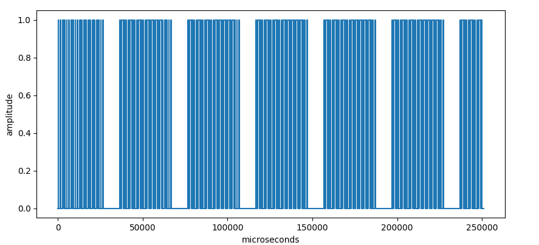
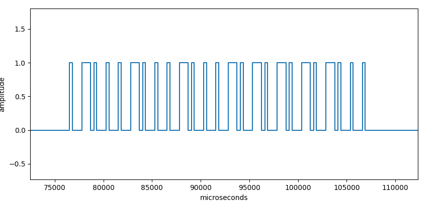

# 433.py
A command-line tool to record, plot and replay arbitrary digital 433mhz signals using a Raspberry Pi.

Using this tool, a Raspberry Pi and a set of cheap [433mhz receiver/sender modules](https://www.amazon.de/433-mhz-transmitter/s?k=433+mhz+transmitter) you can work with 433mhz signals.
This allows to clone key fobs, garage door openers and remote controls that send data on 433mhz.
These kind of devices typically sends a static repeating code when their buttons are pressed.
Once you recorded a code with `--record`, you can view it using `--plot` and replay it using `--send`.


## How to use it?
```
usage: 433.py [-h] (--record GPIO | --plot | --send GPIO) [--recordlen MS] FILE

positional arguments:
  FILE            the json file to load or store a signal

options:
  -h, --help      show this help message and exit
  --record GPIO   record a signal on gpio pin GPIO and store it in FILE
  --plot          plot the signal stored in FILE
  --send GPIO     replay the signal stored in FILE on gpio pin GPIO
  --recordlen MS  amount of milliseconds to record (defaults to 250ms)

```

## Example
We will use the tool to clone the remote control of a set of remote controlled power sockets like [these](https://www.amazon.de/Brennenstuhl-Funkschalt-Set-Funksteckdosen-Funksteckdose-Kindersicherung/dp/B07CGBRS7T/).

### Wiring
The receiver module is typically rectangular and should have 4 pins: VCC, DATA1, DATA2, GND. Connect VCC to the Pi's 3.3V output, GND to the Pi's GND and either DATA1 or DATA2 to one of the Pi's [GPIO pins](https://www.raspberrypi.com/documentation/computers/raspberry-pi.html#gpio-and-the-40-pin-header). Note the GPIO number (not the pin number) that you connected to DATA. The GPIO number depends on the specific board you are using. See the [pigpio documentation](https://abyz.me.uk/rpi/pigpio/#GPIO) for a board-dependant pin/gpio mapping.

The typically square sender module has only 3 pins: DATA, VCC, GND. Connect VCC to the Pi's 5V output, GND to the Pi's GND and DATA to another one of the Pi's GPIO pins. Note the GPIO number.

For our example, we use a *Raspberry Pi Zero W*. We connected the receiver module to GPIO 27 (= pin 13) and the sender to GPIO 23 (= pin 16).

### Recording
Make sure the pigpio daemon is running on the Pi using ```sudo pigpiod```. Hold down one of the remote control's buttons and run
```
./433.py --record 27 signal.json
```
to record 250ms of the remote's signal into the file ```signal.json```. The length of the recording can be adjusted using ```--recordlen```. After the recording, the tool prints the number of recorded signal change edges. This value can serve as a indicator if the recording was successfull. In case of the remote control used for this example, an amount of around 1200 edges/second were normal.

### Plotting
If your Pi does not have a display, it is possible to execute this step on another machine. Just copy the recorded json file to another machine. Then run
```
./433.py --plot signal.json
```
to display the recorded signal in an interactive window using mathplotlib.



It is possible to zoom into the plot and check whether the recording was successful, how the signal is encoded and if it actually repeats itself.



### Replaying
To replay the signal stored in the file ```signal.json``` simply run
```
./433.py --send 23 signal.json
```
